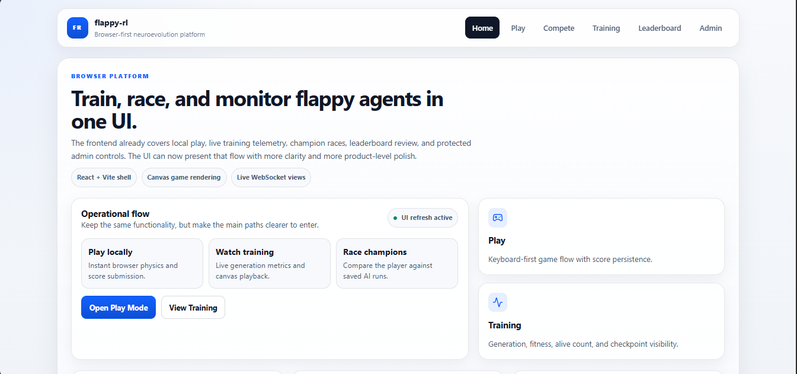
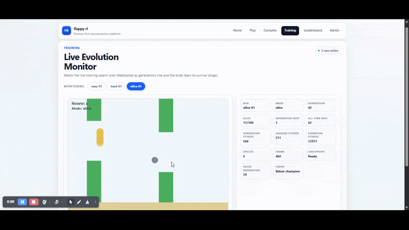
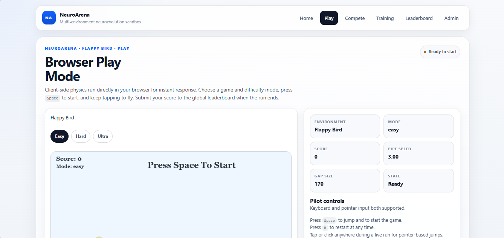
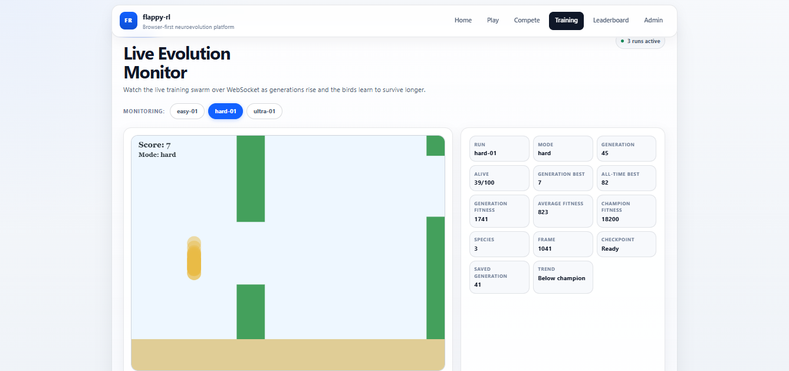

# NeuroArena

<div align="center">
  
  <p align="center"><em>A General Multi-Environment Neuroevolution Sandbox — train AI, watch it evolve, compete against it.</em></p>
</div>

**NeuroArena** (`neuro-arena`) is a browser-first platform for training and visualising Reinforcement Learning agents across multiple game environments. It applies **NEAT (NeuroEvolution of Augmenting Topologies)** to evolve neural networks in real time, streaming every frame to a React frontend over WebSocket so you can watch intelligence emerge, generation by generation.

Flappy Bird is the first environment. The architecture is built to support arbitrary new environments — side-scrollers, multi-agent intersections, turn-based games — with minimal boilerplate.

## Current Features

- FastAPI backend with REST and WebSocket endpoints
- **Multi-environment abstraction** (`BaseEnvironment`) — add new games by implementing one interface
- Flappy Bird: local Pygame play, browser play (client-side physics), multi-mode difficulty (Easy / Hard / Ultra with dynamic difficulty, pickups)
- Live training monitor streaming a NEAT bird swarm over WebSocket in real time
- Fitness and score charts per generation
- Admin panel for starting, resuming, and stopping **multiple concurrent named training runs**
- JWT-protected admin routes with browser login
- NEAT hyperparameter overrides (pop size, mutation rates, etc.) configurable per run from the UI
- Compete mode — choose a saved AI champion genome and race against it in the browser
- Champion genome persistence under named run folders (`checkpoints/<run-name>/champion.pkl`)
- Historical best snapshots and resumable NEAT population checkpoints
- MongoDB-backed leaderboard with browser score submission

## UI Showcase

<div align="center">
  
  <p align="center"><em>Visualising server-side Neuroevolution in real-time</em></p>
</div>

| Play Mode | Training Monitor |
| :---: | :---: |
|  |  |
| *Direct Browser Controls* | *Real-time Neuroevolution Progress* |

## Architecture

NeuroArena has a clean four-layer architecture:

```
neuro-arena/
├── src/
│   ├── core/                  # BaseEnvironment interface + Spaces
│   ├── environments/          # All game environments
│   │   ├── registry.py        # env_id → class mapping
│   │   └── flappy_bird/       # Flappy Bird env + config + neat.cfg
│   ├── ai/                    # Generic NEAT trainer (env-agnostic)
│   ├── db/                    # MongoDB client
│   ├── server/                # FastAPI app, routers, WebSocket handler
│   └── main.py                # Local runtime entrypoint
├── web/
│   └── src/
│       ├── environments/      # Per-env frontend renderers + engine
│       │   └── FlappyBird/    # FlappyBird client-side engine
│       └── pages/             # React pages (Play, Train, Compete, Admin…)
├── config/                    # Legacy config root (env configs live in src/environments/)
├── checkpoints/               # Named training run directories + saved champions
├── assets/                    # Showcase images and screenshots
├── docs/                      # Developer guides
└── scripts/                   # Dev helpers
```

## Stack

| Layer | Technologies |
|---|---|
| **Language** | Python 3.10+, TypeScript |
| **Package Management** | `uv` (backend), `npm` (frontend) |
| **Web Framework** | FastAPI + Uvicorn (ASGI) |
| **AI/ML** | `neat-python` (NEAT neuroevolution) |
| **Database** | MongoDB (async via `motor`) |
| **Streaming** | WebSockets (native ASGI) |
| **Local Play** | `pygame-ce` |
| **Frontend** | React + Vite, Zustand, Recharts, HTML5 Canvas |
| **Auth** | JWT (admin routes) |

## Quick Start

### 1. Clone and install

```bash
git clone https://github.com/your-username/neuro-arena.git
cd neuro-arena

# Backend
uv sync

# Frontend
cd web && npm install && cd ..
```

### 2. Configure env files

```bash
cp .env.server.example .env.server   # set ADMIN_PASSWORD + MONGODB_URI
cp .env.web.example .env.web
```

### 3. Run

```bash
# Terminal 1 — backend API
uv run python -m src.main --serve

# Terminal 2 — frontend
cd web && npm run dev
```

Open `http://localhost:5173` in your browser.

Or use the dev helper which starts both:

```bash
sh scripts/dev.sh
```

## Running Modes

| Command | What it does |
|---|---|
| `uv run python -m src.main --serve` | API + WebSocket server only |
| `uv run python -m src.main --human` | Local Pygame play window |
| `uv run python -m src.main --train --serve --run-name my-run` | Training + API server |
| `uv run python -m src.main --train --serve --resume --run-name my-run` | Resume from checkpoint |

Training can also be started from the browser Admin panel without CLI flags — the Admin page lets you create, resume, and stop named runs.

## Environment Variables

**`.env.server`**

```bash
MONGODB_URI=mongodb://localhost:27017
MONGODB_DATABASE=neuro_arena
ADMIN_PASSWORD=change-me
ADMIN_JWT_SECRET=change-me-secret
```

**`.env.web`**

```bash
VITE_API_BASE_URL=http://localhost:8000
VITE_TRAINING_WS_URL=ws://localhost:8000/ws/training
VITE_COMPETE_WS_URL=ws://localhost:8000/ws/compete
```

## Local URLs

| URL | Service |
|---|---|
| `http://localhost:5173` | Frontend |
| `http://localhost:8000` | Backend API |
| `http://localhost:8000/health` | Health check |
| `ws://localhost:8000/ws/training/{run_name}` | Training WebSocket stream |
| `ws://localhost:8000/ws/compete` | Compete WebSocket |

## Verification

```bash
# Python tests
uv run pytest tests/ -v

# Backend lint
uv run ruff check src

# Frontend type-check
cd web && npx tsc --noEmit

# Frontend build
cd web && npm run build
```

## Developer Guide

See [`docs/developer-guide.md`](./docs/developer-guide.md) for a full walkthrough on:
- Local development workflow
- Adding a new game environment (backend + frontend)
- Architecture deep-dive
- Testing strategy

## Roadmap

- [ ] T-Rex Run environment
- [ ] 4-Way Traffic Intersection (multi-agent)
- [ ] Chess (turn-based, self-play)
- [ ] Lobby / game selector UI
- [ ] Per-environment leaderboard filters
- [ ] Replay recording and playback

## License

MIT
